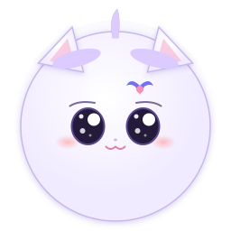

# Live2D 桌面伙伴

基于 Electron 的 Windows 透明桌面伙伴。应用使用无边框、透明、默认置顶的宠物窗口呈现 Live2D 或透明 WebM 角色，支持拖动、互动、AI 对话与语音播放；Live2D 角色还支持近距离光标跟随和语音口型。角色、行为、AI 和系统选项集中在独立设置窗口中管理。

<p align="center">
  
</p>


## 页面预览

| **角色**（玻璃质感主题） | **行为**（玻璃质感主题） | **AI**（玻璃质感主题） | **系统**（玻璃质感主题） |
|:---:|:---:|-----|-----|
|  |  |  |  |
| **角色**（玻璃质感主题） | **行为**（玻璃质感主题） | AI（玻璃质感主题） | 系统（玻璃质感主题） |
|  |  |  |  |

预览图展示玻璃拟态与治愈手账两套界面方向；应用内可在系统页切换主题。

## 功能亮点

### 桌面宠物与交互

- 透明、无边框、不占任务栏；默认置顶，但不会在启动时抢走当前窗口焦点。
- 单击会根据头部或身体命中区域回应，双击触发夸奖反应，三击触发兴奋反应；长按会触发摸头或安静陪伴。
- 在可交互区域按住并拖动窗口，位置会自动保存；支持多显示器、分数 DPI 和贴近屏幕边缘。
- 在角色上滚动鼠标滚轮，可以按 5% 步进调整当前角色尺寸；每个模型分别保存缩放比例。
- 对 Live2D 角色，光标靠近时驱动头部、眼睛和身体跟随，远离后回正并降低无效采样。
- 可开启闲置行为：30 秒进入普通待机，90 秒提示困倦，180 秒进入深度休息。
- 自适应渲染会按状态在 60 / 30 / 20 / 10 FPS 之间切换，也可固定选择省资源或高质量模式。
- 支持精细角色命中、完整透明窗口“背景检测”和全局鼠标穿透锁定三种交互范围。
- 系统托盘与右键菜单提供显示/隐藏、互动、暂停动画、切换角色、锁定、刷新模型、设置和退出入口。
- 模型切换、隐藏与恢复时会清理或恢复 WebGL/视频、纹理、音频和动画调度状态。

### 设置与角色管理

- 真正的全新用户首次启动时自动打开居中的设置窗口；已有配置升级不会重复弹出。
- 设置分为“角色 / 行为 / AI / 系统”四页，所有选项即时生效并自动持久化。
- 提供“安静陪伴 / 自然互动 / 省电陪伴”三组快捷预设，也可以继续逐项微调。
- 角色卡片支持自动封面、横向浏览、拖动排序、切换、昵称和独立尺寸。
- 每个角色都可以编辑基础设定、世界观、与用户的关系和表达规则；这些内容会同时用于 AI 角色提示词。
- 可直接在设置页预览当前模型提供的动作与表情，并把角色移动到当前显示器的四角或中央。
- 设置页提供“玻璃拟态 / 治愈手账”两套主题；每套主题可独立选择玻璃、甜美、像素或科幻气泡。
- 可将桌面宠物的实时画面作为设置页动态背景，并支持系统减弱动态效果偏好。
- 支持始终置顶、Windows 登录时启动、恢复默认设置和应用内版本更新。

### AI 对话与语音

- 内置 DeepSeek 文本对话适配器，支持 `deepseek-v4-flash` 与 `deepseek-v4-pro`。
- 内置智谱 `glm-tts` 语音适配器，可选择多种音色，并配置语速和音量。
- 内置阿里云百炼 `qwen3-tts-flash` 非实时语音适配器，提供 48 个官方音色及在线试听。
- 文本模型与语音模型独立配置、启用或停用；只启用文本模型也可以正常聊天。
- 对话记录按角色隔离并持久化，切换角色后会恢复各自历史；历史条数和回复长度可以配置。
- 角色昵称、档案和表达规则会进入系统提示词；模型返回的情绪标签会转换成角色动作和表情。
- AI 回复可显示在跟随角色位置的聊天面板与气泡中；语音播放时实时驱动 Live2D 口型。
- 聊天面板支持折叠、静音、单条语音重播和清空当前角色对话。
- DeepSeek、智谱和阿里云百炼 API Key 优先从项目根 `.env` 读取，缺项时回退同名系统环境变量；旧版本已保存的本机加密 Key 仅作为最后兼容兜底。完整 Key 不会回显或写入日志。
- 生成的 TTS 音频按月份归档到用户数据目录，应用升级不会覆盖。
- 系统页可按需开启本机外部消息服务；外部系统可通过统一 POST 接口或 WebSocket 发送直连消息、AI问答消息，并独立指定是否语音播报。
- 外部语音按“文本 + 当前 TTS 插件声明的语音配置”持久缓存：Qwen-TTS 使用模型与音色，GLM-TTS 使用模型、音色、语速与音量；App 内聊天语音仍逐次实时生成。
- App 内消息与外部系统消息使用 `APP` / `外部` 来源标识；外部消息只以最高优先级占用角色气泡，不弹出、不写入也不改变底部聊天框。App 与外部 AI问答使用独立上下文和请求通道，彼此不会取消或混用。
- AI 阶段气泡会保持到对应工作完成：`思考中…` 仅在 AI 回复完成后切换，`语音合成中…` 仅在 TTS 完成后切换为正文；两种过程文字都不记入历史。

## 内置模型

当前仓库随应用打包以下角色：

- `mori-suit`（全新用户的默认角色）
- `hiyori`
- `mao_pro`
- `cafe-gun`
- `deepseek-pet`（透明 WebM 动画版 DeepSeek 小蓝鲸）

应用也会扫描安装目录和用户数据目录中的模型。用户目录里的同名模型优先级最高，可以覆盖内置版本。

## 下载体验与历史版本

当前体验版面向 Windows 10/11 x64，可直接下载安装；版本表按最近更新日期倒序排列。

| 版本                | 更新日期   | Windows 安装包                                               | 简要更新说明                                                 | 完整日志                                               |
| ------------------- | ---------- | ------------------------------------------------------------ | ------------------------------------------------------------ | ------------------------------------------------------ |
| **1.0.1（当前版）** | 2026-09-15 | [下载 EXE 体验版](https://qny.luckyblank.cn/live2d-pet/Live2DCompanion-Setup-1.0.1.exe) | 重构角色、行为、AI、系统四页设置中心；新增双主题、AI/TTS、外部消息、DeepSeek WebM 桌宠、应用内更新及交互与性能修复。 | [查看 v1.0.1 更新说明](release/release-notes-1.0.1.md) |

更新程序读取的清单为 [`latest.yml`](https://qny.luckyblank.cn/live2d-pet/latest.yml)。如浏览器或安全软件拦截下载，请确认地址域名为 `qny.luckyblank.cn`，并在运行前按需校验文件。

## 快速开始

### 前置条件

1. Windows 10/11 x64。
2. Node.js 18 或更高版本。
3. 使用 Live2D 角色时确认 `static/live2dcubismcore.min.js` 存在。若仓库副本不包含该文件，请从 [Live2D Cubism SDK for Web](https://www.live2d.com/download/cubism-sdk/) 中复制 `Core/live2dcubismcore.min.js` 到 `static/`。Cubism Core 不由 npm 提供，并受 Live2D 官方许可约束；透明 WebM 角色不依赖 Cubism Core。

### 安装与运行

```bash
npm install
npm start
```

开发模式会额外打开开发者工具：

```bash
npm run dev
```

### 检查与打包

```bash
npm run check
npm run lint
npm run qa:check
npm run package:win
```

`npm run check` 会检查主进程、两个 preload、模型检查器、AI 插件和两个 renderer 脚本的 JavaScript 语法。`npm run package:win` 会先运行该检查，再通过 electron-builder 生成 x64 NSIS 安装包，产物位于 `dist/`。`设计稿/` 与 `design-demos/` 仅用于仓库内的视觉基准、设计原型与验收，已通过 `build.files` 明确排除，不会进入正式应用包。

## 设计与 UI 开发规范

`设计稿/` 是当前 App 界面的视觉事实来源，完整规范见 [`设计稿/README.md`](设计稿/README.md)。现有代码和 `docs/` 继续作为功能、数据、安全与平台约束的事实来源；设计图没有画出的能力不得据此直接删除。

所有 UI 开发，尤其是由 AI 执行的 UI 开发，必须按以下门禁进行：

1. 打开并检查本次范围内的设计图，确定页面、主题、状态和局部详图。
2. 在改代码前输出“风格锁定”，列出主题、准确的参考文件、不可偏离的视觉特征、保留行为、待确认项和验收截图。
3. 只按已锁定的单一主题实现；局部详图优先于同主题整页图，整页图优先于 `主设计稿.png`，不得把玻璃质感与二次元治愈风格拼成第三套风格。
4. 在目标窗口尺寸和相同状态下截图对照，并执行 `npm run check`、`npm run lint` 及受影响范围的 QA。任何有意偏离都要记录原因。

主题、目标页或关键状态不明确时，AI 必须先请用户确认，不能自行补出一套通用 Dashboard 或“AI 风格”界面。

完整的可用命令如下：

| 命令 | 用途 |
|---|---|
| `npm start` | 使用 nodemon 启动 Electron，源码变化时自动重启 |
| `npm run dev` | 同上，并为宠物窗口打开独立 DevTools |
| `npm run check` | 检查应用核心 JavaScript 文件语法 |
| `npm run lint` | 对仓库中的 JavaScript 执行 ESLint |
| `npm run qa:check` | 检查全部 QA 脚本语法 |
| `npm run qa:conversation` | 验证逐角色对话持久化、切换和清理 |
| `npm run qa:external-messages` | 验证外部消息 HTTP、WebSocket、消息历史、归档语音、校验、幂等与串行队列 |
| `npm run qa:qwen` | 验证 Qwen-TTS 非流式请求、试听清单、下载和本地归档 |
| `npm run qa:settings` | 验证设置页主题、布局、交互和模型排序 |
| `npm run qa:chat` | 验证聊天布局、气泡生命周期和滚动稳定性 |
| `npm run qa:background` | 验证设置页宠物动态背景链路 |
| `npm run qa:directory` | 验证 Windows 目录型 Live2D 模型加载 |
| `npm run qa:video` | 冒烟验证透明 WebM 首帧与语义动作切换 |
| `npm run qa:ai-environment` | 验证 AI Key 按 `.env`、系统环境变量、本机加密值的顺序解析 |
| `npm run qa:release-upload` | 验证七牛云发版计划、环境变量解析和路径安全检查 |
| `npm run package:win` | 检查并构建 Windows 安装包 |
| `npm run release:upload:dry-run` | 校验现有构建产物并预览七牛云上传与 CDN 刷新计划，不执行网络写入 |
| `npm run release:upload` | 将现有版本产物覆盖上传到七牛云并刷新对应 CDN 文件缓存 |
| `npm run release:upload:no-refresh` | 只覆盖上传现有版本产物，不提交 CDN 刷新；仅用于排障 |
| `npm run release` | 检查、构建 Windows 安装包、覆盖上传七牛云并刷新 CDN 缓存 |
| `npm run reset:new-user` | 备份现有用户数据，准备全新用户测试环境 |

运行 `npm run reset:new-user` 前必须退出正式版和开发版应用。脚本不会删除用户数据，而是将 `%APPDATA%\Live2DCompanion\` 移动到 `%APPDATA%\Live2DCompanion-new-user-backups\<时间戳>\`，方便之后手动恢复。

外部系统接入与测试页说明见 [docs/external-system-integration.md](docs/external-system-integration.md)。七牛云凭据、上传参数及完整发版流程见 [RELEASE.md](RELEASE.md)，模型与 AI 插件开发规范见 [docs/extension-guide.md](docs/extension-guide.md)，QA 脚本说明见 [qa/README.md](qa/README.md)，当前更新日志见 [release/release-notes.md](release/release-notes.md)。

## Codex 仓库技能

仓库在 `.agents/skills/` 中提供两项项目级 Codex 技能。它们随 Git 仓库维护，不依赖某位开发者的个人 `$CODEX_HOME`、本机绝对路径或额外插件：

| 技能 | 显式调用 | 适用范围 |
|---|---|---|
| [宠物模型开发](.agents/skills/pet-model-development/SKILL.md) | `$pet-model-development` | Cubism 3 Live2D、`video-pet-v1` 透明 WebM、动作、表情、命中、光标跟随、口型、互动映射、封面与模型 QA |
| [AI 模型开发](.agents/skills/ai-model-development/SKILL.md) | `$ai-model-development` | Chat/TTS 插件清单与适配器、模型和音色、凭据、情绪标签、对话历史、音频归档、设置接入与 AI QA |

clone 后无需安装这两个技能。从仓库根目录或任意子目录启动 Codex，它会向上扫描仓库中的 `.agents/skills`；可以显式输入技能名，也可以用自然语言让 Codex 按技能的 `description` 自动匹配：

```text
$pet-model-development 帮我接入一个新的 Live2D 角色并验证动作与表情
$ai-model-development 帮我增加一个新的 TTS 供应商并完成安全与回归检查
```

两个技能的 `agents/openai.yaml` 均启用了隐式调用。若在已经打开的 Codex 会话中执行 `git pull` 后没有立即看到新技能，重新启动 Codex 即可。官方的目录结构、发现范围和调用方式见 [Build skills](https://developers.openai.com/codex/skills)。

这些技能是仓库开发说明，不是 Electron 应用中的 AI 插件，也不会向模型服务发送请求。要让其他 clone 用户获得它们，提交代码时必须包含完整的 `.agents/skills/` 目录，并确保该目录没有被 `.gitignore` 排除。项目模型或 AI 插件契约发生变化时，应同步更新相应技能及其 `references/`，避免技能继续指导旧接口。

## 使用方式

| 操作 | 结果 |
|---|---|
| 单击头部 | 摸头回应、动作、气泡与轻量特效 |
| 单击其他部位 | 好奇回应与点击反馈 |
| 快速双击 / 三击 | 夸奖回应 / 兴奋回应 |
| 长按约 650 ms | 头部触发摸头，其他部位触发安静陪伴 |
| 按住并移动约 6 px | 开始拖动宠物窗口，松开后保存位置 |
| 在角色上滚动滚轮 | 调整当前角色尺寸，范围为 50%～200% |
| 右键角色 | 打开互动、聊天、模型、锁定和设置快捷菜单 |
| 托盘图标 | 显示或隐藏角色 |
| 托盘菜单 | 互动、切换角色、暂停动画、锁定、刷新模型、设置或退出；开启外部接入后可选择 APP/浏览器调试窗口，开启长截图且设置窗口可见时可截取当前 Tab |
| `Ctrl+M` | 打开设置的角色页 |
| `Ctrl+L` | 切换锁定状态 |
| `Ctrl+I` | 触发一次随机互动 |
| `Ctrl+Shift+S` | 开启“APP 长截图”后，在设置窗口中截取当前选中的 Tab 页面 |

锁定后宠物窗口会完全穿透鼠标，请从系统托盘菜单解除锁定。`Ctrl+M`、`Ctrl+L`、`Ctrl+I` 由宠物窗口处理；`Ctrl+Shift+S` 由设置窗口处理，并且仅在“APP 长截图”已开启时生效。

## AI 对话与语音

在设置的“AI”页配置所需服务。文本模型组使用 DeepSeek，语音模型组可选择智谱 `glm-tts` 或阿里云百炼 `qwen3-tts-flash`；两种能力分别维护当前启用的适配器，因此可以只聊天、只停用语音，或独立更换服务。

复制 `.env.example` 为项目根 `.env`，分别填写 `DEEPSEEK_API_KEY`、`ZHIPU_API_KEY` 和 `DASHSCOPE_API_KEY`。每一项都优先使用 `.env` 中的非空值；该项为空或不存在时读取同名系统环境变量；两者都没有时，才兼容读取旧版本通过 Electron `safeStorage` 保存的本机加密 Key。修改 `.env` 或系统环境变量后需要完整重启应用。设置页只显示脱敏预览，请求由主进程直接发往服务商。

每个角色拥有独立的昵称、档案和对话历史。发送消息时，主进程会组合当前角色设定、昵称、最近历史和回复长度限制；回复中的情绪标签不会显示给用户或写入 TTS 文本，而是用于选择相应动作和表情。

智谱与 Qwen-TTS 生成的 WAV/PCM 文件保存在 `%APPDATA%\Live2DCompanion\tts\YYYY-MM\`。Qwen-TTS 使用非流式 HTTP 输出，并会在服务端临时地址失效前下载完整 WAV 留档。外部消息还会把完整音频缓存到 `tts\cache-v1\`：缓存键不写入明文消息或 API Key，命中后仍为当前消息创建独立的历史归档。聊天默认静音；解除静音后，新回复会自动合成并播放，已生成的消息也可单独重播。

## 用户数据目录

应用固定使用 `%APPDATA%\Live2DCompanion\`，开发版与安装版共享这一路径：

| 路径 | 内容 |
|---|---|
| `config.json` | electron-store 保存的窗口位置、偏好、模型顺序/缩放/昵称/档案、AI 状态、逐角色对话和最近 200 条外部消息历史 |
| `models\` | 用户添加的 Live2D 模型；同名模型覆盖内置版本 |
| `plugins\` | 用户添加的 AI 插件；同名插件覆盖内置版本 |
| `covers\` | 设置页角色卡片自动生成的封面缓存 |
| `tts\YYYY-MM\` | 按月份归档的语音文件 |
| `tts\cache-v1\` | 外部语音内容寻址缓存，最多 200 项 / 256 MiB，超限时优先清理最久未使用项 |

上述目录不属于安装包内容，覆盖安装或应用升级不会重写其中的数据。

## 项目结构

```text
electron-live2d/
├── .agents/
│   └── skills/
│       ├── pet-model-development/ # 宠物模型开发决策、契约与验证流程
│       └── ai-model-development/  # Chat/TTS 模型插件开发与验证流程
├── main.js                 # 窗口、托盘、IPC、持久化、模型发现与更新下载
├── model-inspector.js      # 目录/ZIP 模型格式检查
├── preload.js              # 宠物窗口桥接 API
├── settings-preload.js     # 设置窗口桥接 API
├── config/
│   ├── defaults.json       # 新用户设置与内置角色档案的唯一默认源
│   ├── defaults.js         # 默认值冻结、迁移初始化辅助
│   ├── environment.js      # .env 解析以及项目配置/系统环境变量优先级
│   └── bubble-styles.js    # 按主题注册气泡样式
├── ai/
│   ├── plugin-manager.js   # AI 插件发现、凭据、启用状态、记忆和语音归档
│   └── tts-cache.js        # 外部语音的插件配置感知型持久缓存
├── plugins/
│   ├── deepseek/           # DeepSeek 文本对话适配器
│   ├── zhipu-tts/          # 智谱 GLM-TTS 语音适配器
│   └── qwen-tts/           # 阿里云百炼 Qwen-TTS 非实时语音适配器
├── renderer/
│   ├── index.html          # 透明宠物舞台
│   ├── app.js              # Live2D 渲染、互动、聊天、拖动与帧率调度
│   ├── bubble-component.js # 可复用的对话气泡 Web Component
│   ├── styles.css          # 宠物窗口样式
│   ├── settings.html       # 设置窗口结构
│   ├── settings.js         # 设置窗口交互
│   └── settings.css        # 设置窗口视觉样式
├── models/                 # 内置 Live2D 模型（随安装包发货）
├── qa/                     # 不进入安装包的回归验证脚本
├── 设计稿/                 # 不进入安装包的 App 视觉基准、局部详图与开发规范
├── design-demos/           # 不进入安装包的设计原型与验收素材
├── scripts/
│   └── reset-new-user.ps1  # 可恢复的全新用户环境重置工具
├── docs/                   # UI 实现、验收与回归记录
├── release/                # 版本发布说明
├── static/
│   └── live2dcubismcore.min.js
├── resources/
│   └── icon.png
└── package.json
```

## 添加模型

推荐在设置的“角色”页点击“导入 ZIP”。应用会先检查格式，再把通过检查的压缩包复制到用户模型目录；重名时会自动追加序号，不会覆盖现有角色。无效压缩包不会写入用户目录。

当前支持 Cubism 3 格式的两种布局，以及清单驱动的透明 WebM 角色：

```text
# 目录型：model3.json 位于模型 ID 目录根部
%APPDATA%\Live2DCompanion\models\my-character\
├── my-character.model3.json
├── my-character.moc3
└── ...

# ZIP 型：ZIP 内需要保留至少一层模型目录
%APPDATA%\Live2DCompanion\models\my-character\my-character.zip
└── my-character/
    ├── my-character.model3.json
    ├── my-character.moc3
    └── ...

# 透明 WebM 型：pet.json 与其引用的动画放在同一角色目录
%APPDATA%\Live2DCompanion\models\my-video-pet\
├── pet.json
├── idle.webm
└── ...
```

ZIP 必须同时包含 `.model3.json` 和 `.moc3`，且模型文件不能直接平铺在 ZIP 根部。WebM 角色至少要在 `pet.json` 中声明一个 `idle` 动画，格式和扩展方法见 [DeepSeek 桌宠接入说明](docs/deepseek-pet-integration.md)。当前不支持 Cubism 2（`.model.json` / `.moc`）和 ZIP64。手动放置模型后，请从托盘选择“刷新模型列表”；只有状态为可加载的模型会出现在切换菜单中。

内置模型位于项目 `models/` 目录，随安装包发货，供首次安装的用户直接使用。

## 架构与安全边界

项目是纯 JavaScript，没有 TypeScript、Vite 或源码打包步骤；Electron 直接加载 `main.js` 和 `renderer/` 下的文件。

| 进程/窗口 | 主要职责 | WebPreferences |
|---|---|---|
| 主进程 | 生命周期、窗口、托盘、IPC、模型/插件发现、持久化、网络请求 | Node.js 主进程 |
| 宠物 renderer | `live2d-renderer`、WebGL、互动、聊天 UI、口型和调度器 | `nodeIntegration: true`、`contextIsolation: false`、`sandbox: false`、`webSecurity: false` |
| 设置 renderer | 角色、行为、AI、系统设置界面 | `nodeIntegration: false`、`contextIsolation: true`、`sandbox: true`、`webSecurity: true` |

宠物 renderer 的宽松配置是当前 `live2d-renderer` 直接 `require()`、本地 Cubism Core 与 `file://` 模型资源加载链路的兼容要求。若要收紧这些选项，需要先把 Live2D 加载能力迁移到隔离边界之外；不要只删除单个配置项。

主进程会阻止两个本地窗口自行导航或创建新窗口。设置页只能通过受限 IPC 打开 `https:` / `mailto:` 链接；API Key、模型档案与外部输入也会在主进程侧做长度、协议或格式校验。

## 更新与发布

每次打开设置窗口都会检查远端 `latest.yml`。发现更高版本后，设置页会展示发布说明，支持忽略该版本、下载进度、取消下载，并在下载完成后打开安装包。安装包默认保存到系统“下载”目录。

发布前需要同步更新 `package.json` 版本、`release/release-notes-<version>.md` 和远端更新清单。具体文件名、CDN 路径与验证步骤见 [RELEASE.md](RELEASE.md)。

## 许可证

项目代码仅供学习参考。Live2D 模型及 Cubism Core 的版权与许可归各自权利人所有。

`models/deepseek-pet/` 中的动画素材来自 [PC2005-cloud/dsh-pet](https://github.com/PC2005-cloud/dsh-pet)，上游声明为允许开源使用、禁止商用，二次创作、展示或分发时须附原作者仓库地址。实现同时参考了 [MerZlin/dsh-pet-indesktop](https://github.com/MerZlin/dsh-pet-indesktop) 的独立桌宠形态；本项目未捆绑 DSH 软件或两个参考项目的应用代码。
